# Cocos Android 构建流程

```mermaid
flowchart TD
    A["./gradlew assembleRelease"] --> B["Gradle 执行 assembleRelease"]
    B --> C["读取 build.gradle 配置"]
    C --> D["根据 buildTypes 选择 buildType<br/>如 RelWithDebInfo / Release / Debug"]
    D --> E["执行 externalNativeBuild<br/>调用对应的 CMake 任务"]
    E --> F["Gradle 任务：configureCMakeRelWithDebInfo<br/>CMake 配置阶段<br/>产物：cmake_install.cmake<br/>CMakeCache.txt<br/>android_gradle_build.json"]
    F --> G["读取 CMakeLists.txt"]
    G --> H{"USE_PLUGINS?"}
    H -->|Yes| I["cc_gen_plugin_cmake_hook<br/>产物：Pre-AutoLoadPlugins.cmake"]
    H -->|No| J["跳过插件扫描"]
    I --> K["执行 plugins_parser.js"]
    K --> L["扫描 cc_plugin.json 文件"]
    L --> M["递归搜索 native/ extensions/ 目录"]
    M --> N["验证插件配置 platform engine-version"]
    N --> O["生成 Pre-AutoLoadPlugins.cmake<br/>产物：Pre-AutoLoadPlugins.cmake"]
    O --> P["find_package 加载插件"]
    J --> Q["cc_plugin_entry 生成插件注册代码<br/>产物：plugin_registry.cpp"]
    P --> Q
    Q --> R["Gradle 任务：buildCMakeRelWithDebInfo<br/>CMake 编译阶段"]
    R --> S["编译 C++ 源代码"]
    S --> T["生成 libcocos.so 库<br/>产物：libcocos.so"]
    T --> U["Gradle 打包阶段"]
    U --> V["合并 Java 资源"]
    V --> W["合并 JNI 库"]
    W --> X["执行 ProGuard 混淆"]
    X --> Y{"debuggable?"}
    Y -->|true| Z["生成 unsigned.apk<br/>产物：unsigned.apk"]
    Y -->|false| AA["使用签名配置签名"]
    AA --> AB["生成 signed.apk<br/>产物：signed.apk"]
    Z --> AB
    AB --> AC["构建完成<br/>产物：APK/AAB"]

    click A "#流程图中关键文件路径"
    click C "templates/android/template/app/build.gradle" "build.gradle"
    click G "templates/android/template/CMakeLists.txt" "CMakeLists.txt"
    click I "templates/cmake/common.cmake" "cc_gen_plugin_cmake_hook"
    click K "native/cmake/scripts/plugins_parser.js" "plugins_parser.js"
    click Q "templates/cmake/common.cmake" "cc_plugin_entry"

    style A fill:#f9f,stroke:#333
    style F fill:#ff9,stroke:#333
    style L fill:#9ff,stroke:#333
    style T fill:#9f9,stroke:#333
    style AC fill:#9ff,stroke:#333
```

**流程图中关键文件路径：**

- `./gradlew` → 项目根目录
- `build.gradle` → [templates/android/template/app/build.gradle](templates/android/template/app/build.gradle)
- `CMakeLists.txt` → [templates/android/template/CMakeLists.txt](templates/android/template/CMakeLists.txt)
- `common.cmake` → [templates/cmake/common.cmake](templates/cmake/common.cmake)
- `android.cmake` → [templates/cmake/android.cmake](templates/cmake/android.cmake)
- `plugins_parser.js` → [native/cmake/scripts/plugins_parser.js](native/cmake/scripts/plugins_parser.js)
- `predefine.cmake` → [native/cmake/predefine.cmake](native/cmake/predefine.cmake)
- `native/CMakeLists.txt` → [native/CMakeLists.txt](native/CMakeLists.txt)

## 关键节点说明

| 阶段 | 关键文件/命令 | 文件路径 | 说明 |
|------|-------------|---------|------|
| Gradle 配置 | `build.gradle` | [templates/android/template/app/build.gradle](templates/android/template/app/build.gradle) | 定义 ndkPath、cmake 参数、abiFilters |
| CMake 配置 | `CMakeLists.txt` | [templates/android/template/CMakeLists.txt](templates/android/template/CMakeLists.txt) | 入口 CMake 配置文件 |
| CMake 公共配置 | `common.cmake` | [templates/cmake/common.cmake](templates/cmake/common.cmake) | 公共 CMake 配置文件 |
| CMake Android 配置 | `android.cmake` | [templates/cmake/android.cmake](templates/cmake/android.cmake) | Android 平台 CMake 配置 |
| CMake 预定义 | `predefine.cmake` | [native/cmake/predefine.cmake](native/cmake/predefine.cmake) | CMake 预定义配置 |
| Native CMake 配置 | `native/CMakeLists.txt` | [native/CMakeLists.txt](native/CMakeLists.txt) | 原生代码 CMake 入口 |
| 插件解析 | `plugins_parser.js` | [native/cmake/scripts/plugins_parser.js](native/cmake/scripts/plugins_parser.js) | 扫描 cc_plugin.json 生成插件注册代码 |
| 插件配置 | `cc_plugin.json` | 插件目录下 | 插件配置文件 |
| 原生编译 | NDK + Clang | NDK 工具链 | 编译 C++ 代码生成 `.so` 库 |
| APK 打包 | `assembleRelease` | Gradle 任务 | 合并资源、签名生成最终 APK |
